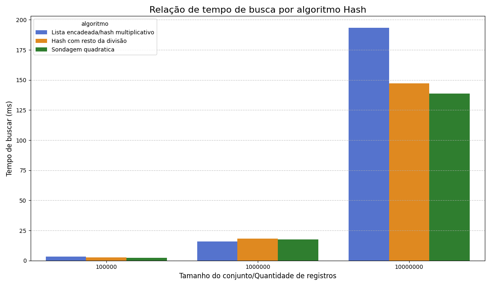
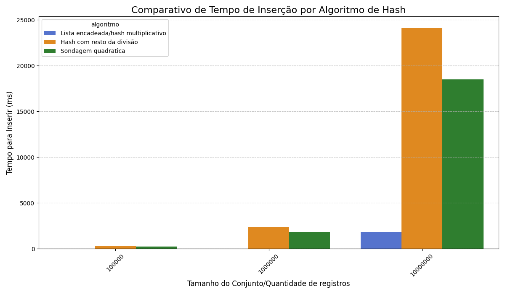
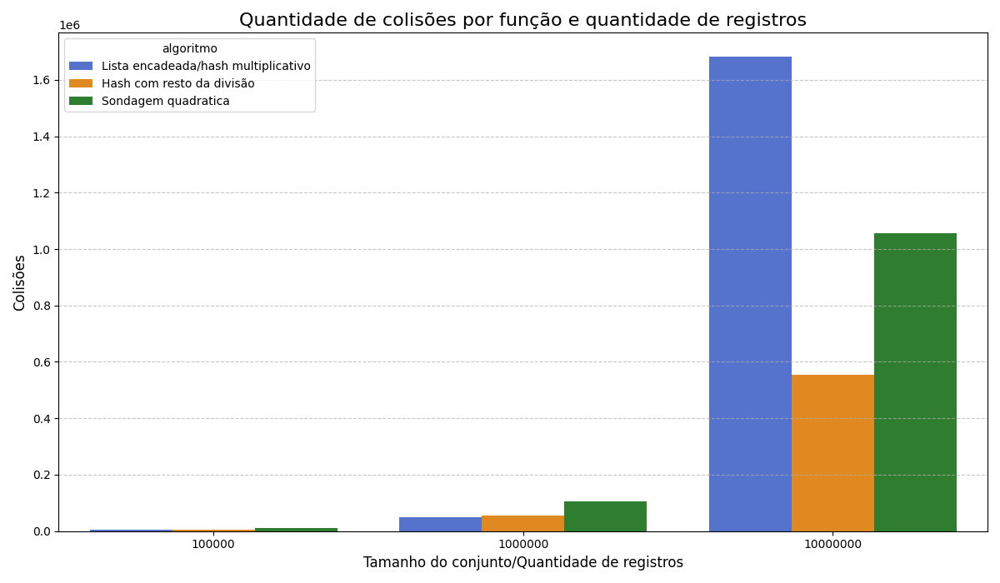
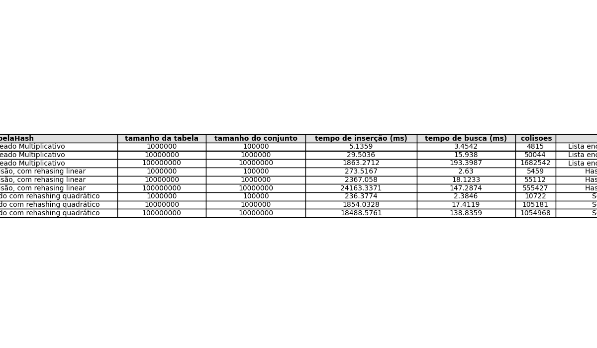

# Hashing
Repositório para o trabalho de hash

Nomes: Renan Herculano, Lucas de Paula, Guilherme Arcanjo, Leandro Pavan

<h1>Preparação do ambiente para gerar os gráficos</h1>
  <ul>
    <li>Primeiro crie o ambiente virtual no python utilizando o comando: <strong> python -m venv GeradorDeGraficos </strong>
    <li>Acesse o ambiente virtual pelo comando: <strong>GeradorDeGraficos\Scripts\activate.bat</strong> (windows) ou
    <strong>source GeradorDeGraficos/bin/activate</strong> (linux ou macOS)</li>
    <li>Instale as bibliotecas para executar o código:
    <strong>pip install -r requirements.txt</strong></li>

  </ul>

<h1>Implementação</h1>
    <h2>Funções Hash</h2>
        
Para a realização do trabalho, envolvendo desempenho de funções hash, foram selecionadas 3 tipos distintos de funções hash e 2 funções rehashing:

        <ul>
            <li>Resto da divisão e rehashing linear</li>
            <li>Hash de multiplicação e listas encadeadas</li>
            <li>Hash de divisão otimizado com números primos e rehashing quadrático</li>
        </ul>
        
<strong>Resto da divisão</strong> utiliza o resto da divisão para mapear a posição ou índice que uma dada chave vai ocupar na tabela, para isso, utilizamos a chave do registro como dividendo, o tamanho da tabela como dividor e o resto(o qual varia de 0 até o tamanho da tabela) como índice. 

        
<strong>Rehashing linear</strong> apenas seleciona o próximo índice ou posição caso houver colisão, ou seja, a posição inicial selecionada pelo resto da divisão estiver ocupada. Isso ocorre até encontrar uma posição disponível

        
<strong>Hash multiplicativo</strong> utiliza um número A = 0.6180339887 e multiplica-o com o valor da chave, o que vai resultar em um número racional e, juntando isso com 'Math.floor(chave * A)', obteremos apenas a parte fracionária/decimal dessa multiplicação. Após isso, essa parte fracionária será multiplicada pelo tamanho da tabela e retirada do número resultante a parte fracionária, esse resultado final será a posição que iremos armazenar nossa chave. Nesse algoritmo, como será usada lista encadeada, não há necessidade de função rehashing para lidar com colisões 

        
<strong>Hash de divisão otimizado</strong> utiliza números primos para garantir uma melhor distribuição das chaves e, para lidar com colisões, combinamos essa função com a função rehashing quadrático, que soma o índice original com o quadrado da quantidade de colisões e seleciona o resto da divisão desse resultado pelo tamanho da tabela. Após isso, é checado se a posição está ou não disponível, se não estiver, é acrescentado uma unidade de colisão

    <h2>Descrição da implementação</h2>
      
A implementação do código segue um fluxo padrão:

      <ol>
        <li>É solicitado ao usuário que selecione o tamanho da tabela, ou seja, o tamanho do array que vai compor as posições da tabela, que pode variar o tamanho entre 1 milhão, 10 milhões e 100 milhões, juntamente associado a quantidade de registros, que poderá ser entre 100 mil, 1 milhão e 10 milhões;</li>
        <li>O programa gera a quantidade de registros usando a classe <strong>GeradorDeDados</strong>, que gera chaves no valor de 100 milhões a 999 milhões em um vetor, utilizando 9 dígitos;</li>
        <li>Esse vetor é percorrido e cada elemento contido nele é inserido na tabela, caso houver colisão, será feito o encadeamento ou usado a função rehashing para escolher outra posição;</li>
        <li>Durante essa etapa é usado a função <strong>System.nanoTime()</strong> para calcular o intervalo de tempo, ocorrendo o mesmo processo na busca dos elementos;</li>
        <li>Após isso é calculado a quantidade de espaços/gaps, para isso, basta percorrer toda a tabela e verificar a maior sequência de registros vazios;</li>
        <li>Por último, é gerado um arquivo csv, o qual é concatenado no arquivo <strong>GeradorDeGraficos.py</strong> para gerar gráfico e tabelas usando as bibliotecas pandas, seaborn e matplotlib.</li>
      </ol>
    <h2>Comparativos</h2>
      </img>
      </img>
      </img>
      </img>
      
Esses são os gráficos comparando cada função, a quantidade de registros e o tempo para inserção e busca. Como esperado, o menor tempo para inserção foi usando a lista encadeada, uma vez que encontrando a posição de uma chave, basta verificar se a posição está nula e, se tiver, apenas percorrer uma lista encadeada, o que é muito mais eficiente, ao contrário da inserção usando hash do resto da divisão e soldagem linear, pois, uma vez ocorrendo colisão, esse algoritmo vai percorrer linearmente todas as posições sucessoras da tabela até encontrar uma livre. 

      
Comparando o processo de busca, não houve uma diferença significativa, portanto, julgamos o algoritmo usando <strong>lista encadeada </strong> para tratar colisões como mais eficiente, uma vez que para inserir 10 milhões de registros em uma tabela de 100 milhões de posições demorou apenas 1863 mili segundos, ou seja, menos de 2 segundos, ao contrário de outros algoritmos que demoraram cerca de 18 segundos e 24 segundos

      